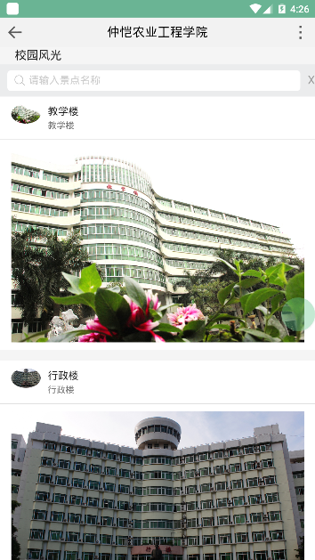
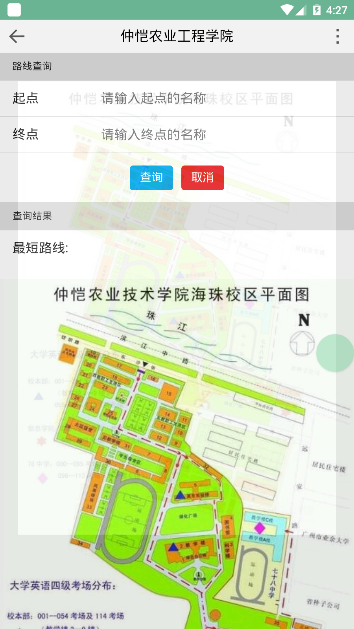
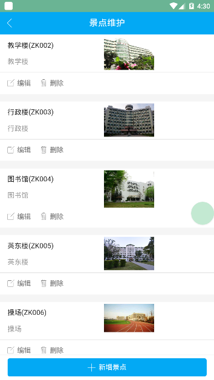

# campus-guide项目说明
### 项目简介

- 校园导游咨询(前端APICloud，后台SpringBoot + Neo4j)，维护和展示校园风景，求景点之间的最短路径。

### 项目目录结构说明

```
├─campus-guide----------------------------
│  │
│  ├─CampusGuide--------------------------APICloud前端APP项目
│  │
│  ├─campus-guide-----------------------Java后台项目
│  │
│  ├─image-----------------------效果图
```

### 运行项目

- 搭建APICloud环境，运行CampusGuide前端APP项目(APICloud环境搭建可以参考官网或百度)
- 安装Neo4j数据库，运行Java后台项目SpringBoot项目

### 效果图

- 校园风光



- 路径查询



- 景点维护

